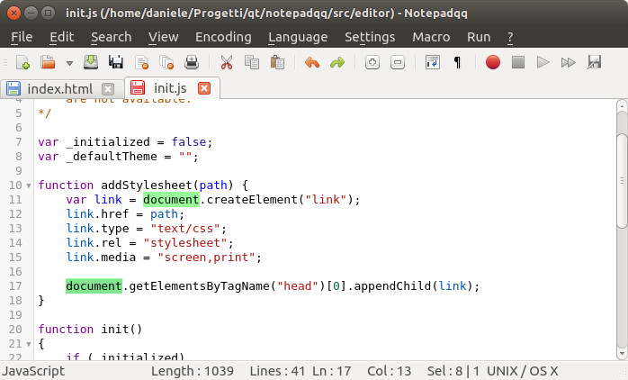
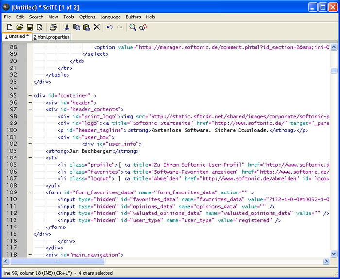
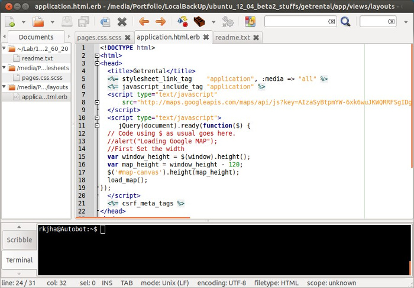
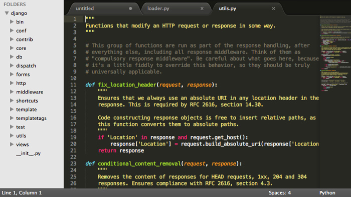
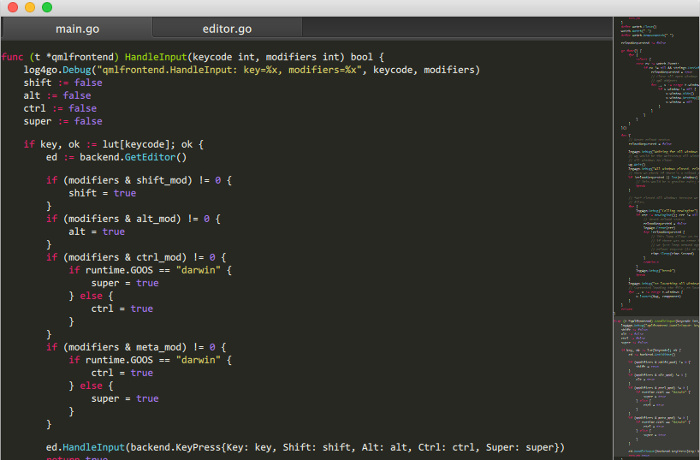
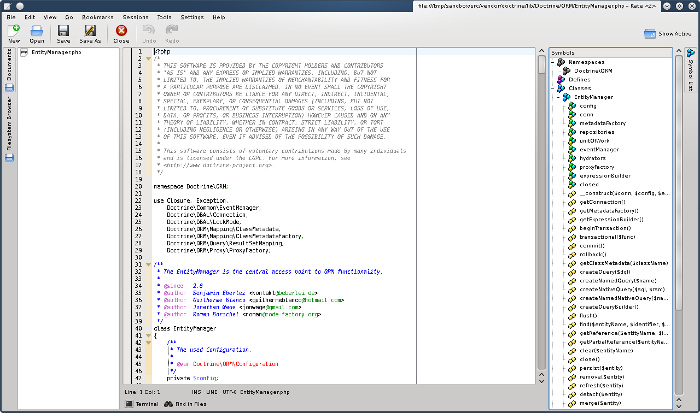
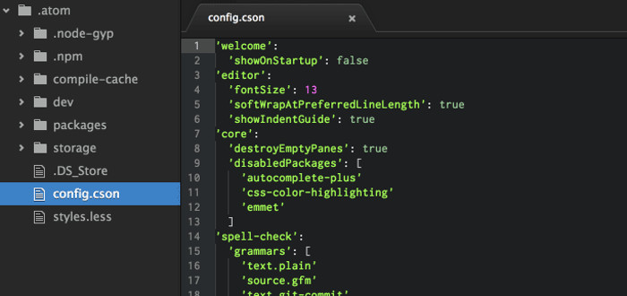

Notepad ++ это мой любимый текстовый редактор в ОС Windows. Однако все чаще мне приходится использовать Linux как основную ОС для рабочего и домашнего десктопа. При этом я все время скучаю по Notepad ++. Мне, как и большинству прльзователей, совсем не ясно почему после нескольких лет Notepad ++ так и не обзавелся клиентом для Linux. И пока все ждут, когда же он стаент доступен, я предлагаю пройтись по доступным альтернативам Notepad ++ для Linux.<!--more-->

Ниже вы найдете список достойных альтернатив Notepad ++ для Linux, которые можно будет использовать в любом дистрибутиве, будь то Ubuntu, Linux Mint, Fedora и т.д.

**Основные задачи, которые я ставлю перед редактором:**

1. Не ресурсоемкий
2.  Должен уметь подсвечивать синтаксис
3.  Поддержка нескольких языков
4. Авто-коррекция
5. Макросы поиска
6. Возможность расширения за счет плагинов.

_Оговорюсь, что консольные редакторы мной не рассматривались._

* * *

## Лучшие альтернативы Notepad ++ для Linux

* * *

##  Notepadqq



Notepadqq является точной копией Notepad ++, по крайней мере, он очень на него похож.

В Ubuntu и подобных ОС его можно установить следующим образом:

```
sudo add-apt-repository ppa:notepadqq-team/notepadqq
sudo apt-get update
sudo apt-get install notepadqq
```

Исходный код для других дистрибутивов Linux: https://github.com/notepadqq/notepadqq

* * *

### SciTE



SciTE это кросс-платформенный редактор с открытым исходным кодом. Функционал можно расширить за счет дополнений. Как я понимаю это один из самых старых редакторов на Linux. Графолюбы конечно же не оценят, но пользоваться им можно.

**Установка:**

```
sudo apt-get install scite
```

Исходный код для других дистрибутивов Linux: http://www.scintilla.org/SciTEDownload.html

* * *

### Geany



Geany это не просто текстовый редактор, это почти ИСP. Отмечу, что Geany доступен для всех настольных платформ, таких как Windows, Linux, OS X, BSD и т.д. Одна из лучших альтернатив Notepad ++ для Linux.

**Установка:**

```
sudo apt-get install geany scite

```

Исходный код для других дистрибутивов Linux: http://www.geany.org/Download/Releases

* * *

### Sublime Text



Sublime Text, это наверное один из немногих non-free продуктов, которые довольно популярны. Внешний вид редактора довольно строгий и многим наверняка приглянется. [Официальный сайт](http://www.sublimetext.com/) позволяет бесплатно и без ограничений ознакомиться с продуктом, однако уведомляет о необходимости приобретения лицензии. **Установка:**

```
sudo add-apt-repository ppa:webupd8team/sublime-text-2
sudo apt-get update
sudo apt-get install sublime-text
```

* * *

### Lime Text

 Не заметили сходства с предыдущим редактором? Напрасно, ведь Lime Text это аналог Sublime Text, который имеет открытый исходный код.

Страница проекта: https://github.com/limetext/lime

Инструкция по сборке: https://github.com/limetext/lime/wiki/Building-on-Ubuntu-14.0

* * *

### Kate

 Пользователи KDE само собой знают об этом редакторе. Kate - это мощный и многофункциональный текстовый редактор. Однако мне он не подошел.

**Установка:**

```
sudo apt-get install kate
```

Исходный код для других дистрибутивов Linux: https://projects.kde.org/projects/kde/applications/kate/repository

* * *

### Atom



По сравнению с другими редакторами, Atom можно считать очень молодым. Однако он уже давным давно приобрел большую популярность.

**Установка:**

```
sudo add-apt-repository ppa:webupd8team/atom
sudo apt-get update
sudo apt-get install atom
```

Исходный код для других дистрибутивов Linux: https://github.com/atom/atom/blob/master/docs/build-instructions/linux.md
