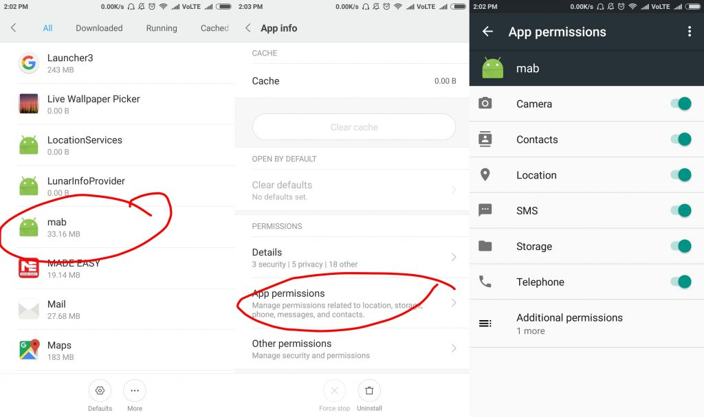

Не так давно во всех новых прошивках смартфонов от компании Xiaomi появилось новое приложение с очень уж подозрительными разрешениями. Во всем интернете есть множество вопросов об этом приложении на совершенно разных языках, но единственного ответа нет нигде.

В статье я напишу, все что удалось выяснить, а так же о способах по его удалению.<!--more-->

## Что такое «mab» в прошивках Xiaomi и как его удалить.

* * *

Как Вам уже стало понятно, новое приложение называется «mab». Меня как и многих заинтересовало, а зачем ему столько разрешений?

Официально известного назначения как я понял попросту нет - на китайском форуме люди все время спрашивают об этом, но ответа от представителей компании не получают. **Есть пара мнений**, которые говорят о том, что приложение якобы блокирует рекламу или защищает бангинг от вредоносного ПО.

* * *

### Как удалить «mab» полностью?

* * *

Отличительной и неприятной особенностью данного приложения является его способность возвращаться, причем делает оно это без лишнего шума - вы можете его удалить, а спустя пару дней с удивлением найти его в списке приложений.

**Для того чтобы наверняка избавиться от  этого приложения можно пойти двумя путями:**

- Заморозить (именно заморозить) его через titanium backup;
- Через любой фм пройти па адресу **data/app/com.xiaomi.ab-1/**, где удалить **base.apk**, который собственно и носит имя **«mab»** в списке софта.

* * *

Если вы узнали что-нибудь новое касательно назначения этого приложения смело делитесь новостью в комментариях.
