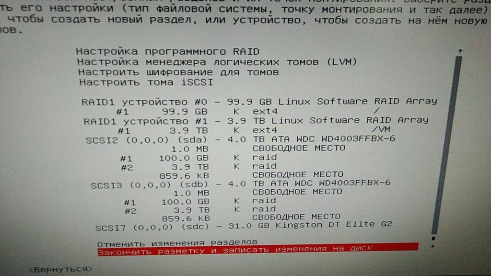
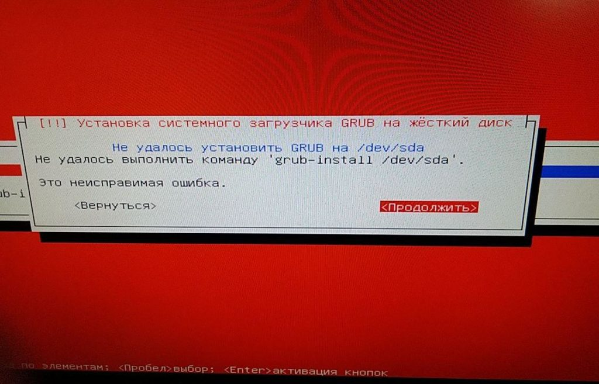
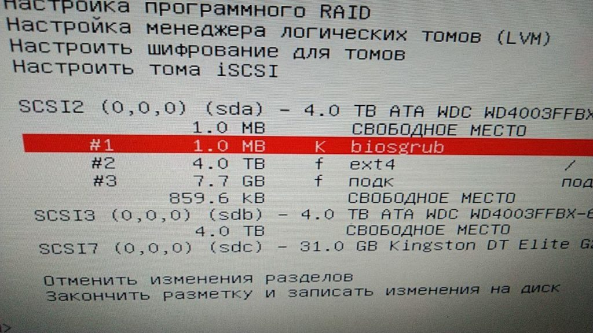

Во время установки Debian 10 на компьютер в котором было установлено 2 HDD по 4TB + был создан Raid 1 я столкнулся с этой ошибкой. Решение оказалось простым, хоть явно об этом нигде и не сказано.<!--more-->

Так вот система устанавливалась в Legacy, без всяких изысков во время разметки дисков.

[](http://admin.netlab-kursk.ru/wp-content/uploads/2020/07/debian_grub_error2-e1596205766141.jpg)

На этапе установки Grub сталкивался со следующим:

[](http://admin.netlab-kursk.ru/wp-content/uploads/2020/07/debian_grub_error1-e1596205846826.jpg)

В логах была одна интересная запись:

```
grub-install: warning: this GPT partition label contains no BIOS Boot Partition; embedding won’t be possible.
```

Интереса ради я решил разметить диск автоматом и инсталятор подкинул ответ:



Выяснилось, что на GPT дисках размером больше 2TB для установки в Legacy BIOS требуется создать раздел размером в 1мб с соотв. флагом.
