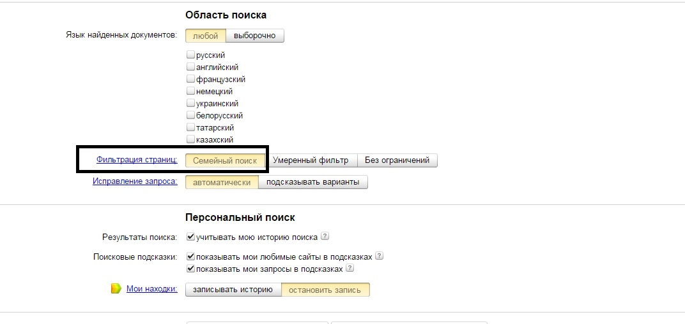
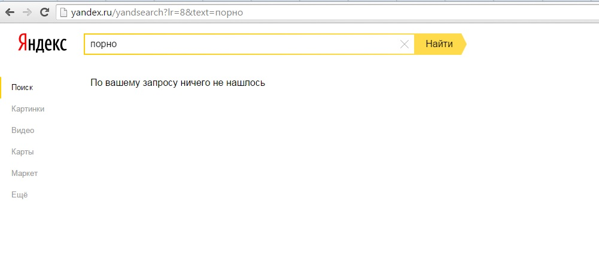
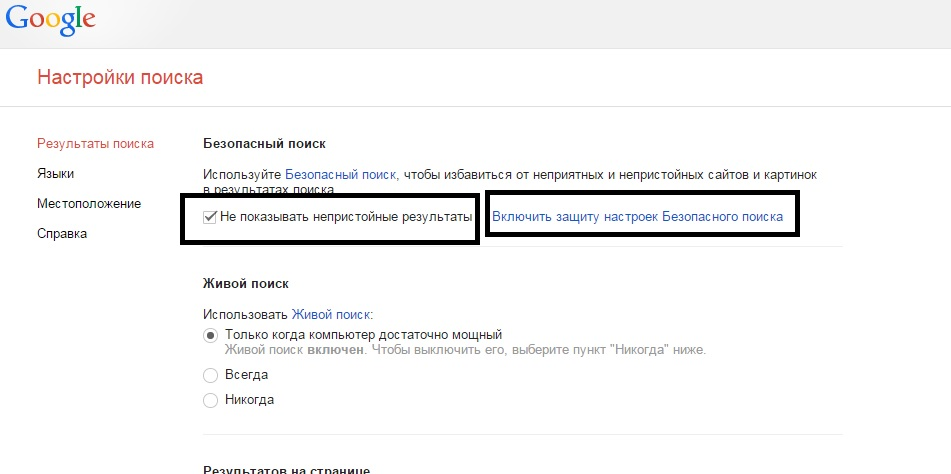
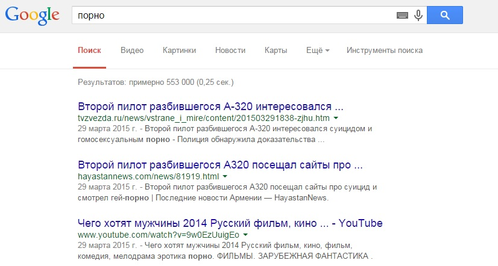
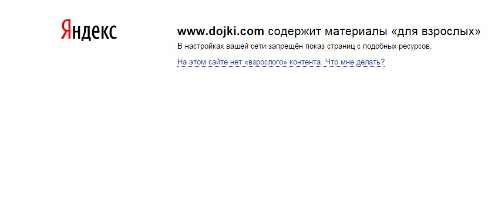
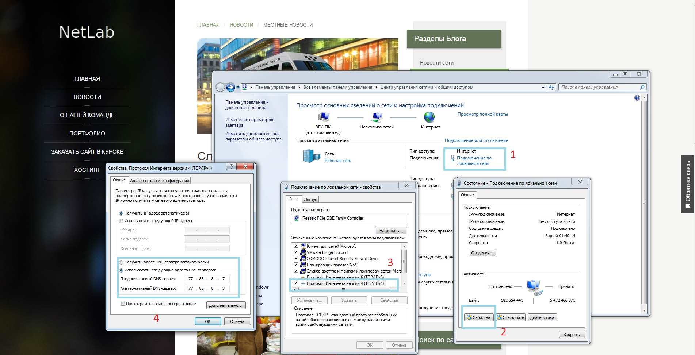
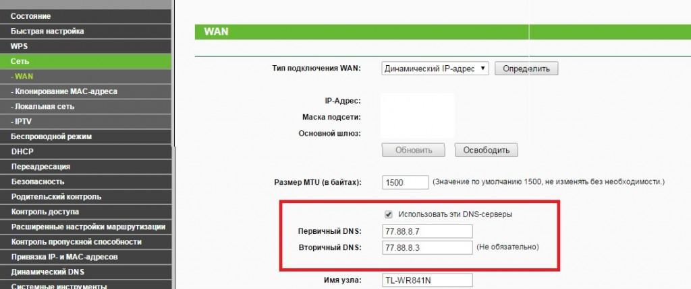

Многие родители со временем начинают беспокоится о том, что их дети сидя в интернете могут наткнуться на порно сайты или непристойные картинки. <!--more-->

В этот момент начинаешь задаваться вопросом: Как заблокировать порно сайты от детей?

> Действенных вариантов существует множество, однако автор статьи не сторонник установки сторонних программ т.к. в своем большинстве они просто дублируют  доступный функционал.

## Способы блокировки порно сайтов

### 1\. Блокировка порно на стороне поисковых систем

Каждый пользователь компьютера для поиска информации использует поисковик, однако не многие знают, о том, что в каждом (почти) из них существует возможность фильтрации результатов выдачи.

* * *

###  **Фильтрация порно сайтов в яндексе:**

Для настройки поиска переходим по ссылке [http://yandex.ru/cgi-bin/customize.pl](http://yandex.ru/cgi-bin/customize.pl)

И устанавливаем переключатель (см. картинку) в положение "Семейный фильтр".

После таких настроек Яндекс не будет отображать непристойные сайты даже после конкретного и понятного запроса "Порно"

* * *

### Фильтрация порно сайтов в Гугле:

Похожий фильтр присутствует и тут, однако есть особенности. Для настройки результатов выдачи переходим по адресу: [http://www.google.ru/preferences?hl=ru](http://www.google.ru/preferences?hl=ru). На странице устанавливаем галочку в отмеченном мною поле, пролистав страницу вниз нажимаем кнопку "Сохранить". В отличие от яндекса, гугл позаботился о том, чтобы ваши дети не могли изменить настройку поиска - поле "Включить защиту настроек" ограничит доступ к их изменению.

 

Результаты поиска после таких настроек как видите просто отличные

 

* * *

Этот способ удобен и не требует сложных действий, но он не универсальный, если открыть тот же рамблер, то он естественно будет искать все. Поэтому или настраиваем каждый поисковик таким образом или читаем статью дальше.

## 2\. Блокировка порно сайтов на сетевом уровне

### Пример использования семейного фильтра на базе яндекс dns

Как наглядно видно на изображении "Яндекс DNS" не просто скрывает порно сайты - он их блокирует. Этот способ на мой взгляд намного лучше.

 

### Как заблокировать порно сайты от детей при помощи Яндекса?

Этот способ в отличие от первого требует чуть больше времени, однако труда он вызывать не должен.

**Вариант первый - у вас дома один ПК и провод "с интернетом", который протянули монтажники подключен напрямую к компьютеру.**

Идем по адресу: Пуск - Панель управления - Все элементы панели управления - Центр управления сетями и общим доступом

 

Открываем подключение по локальной сети - выбираем пункт свойства -  Протокол интернета версии 4 - Использовать следующие адреса.

Семейный фильтр (Без сайтов для взрослых):

- 77.88.8.7
- 77.88.8.3

Безопасный фильтр (Без мошеннических сайтов и вирусов):

- 77.88.8.88
- 77.88.8.2

Для того, чтобы настройки вступили в силу просто выключите и включите подключение.

**Вариант второй - у вас есть wifi роутер**

В случае если в вас есть роутер, то вся настройка должна производится в нем, зачастую на обратной стороне указаны адреса типа : 192.168.1.1 , логин админ, пароль админ.

Если вы сами ничего не меняли, то вписываем адрес 192.168.1.1 в браузере, вводим логин пароль и попадаем на страницу управления вашим роутером. Дальнейшая настройка везде будет отличаться, т.к. у разных роутеров разные интерфейсы, однако принцип везде один:

- В панели управления роутером найдите настройки DNS.
- Пропишите адреса выбранного вами режима Яндекс.DNS в качестве Primary и Secondary DNS-серверов и сохраните изменения.

**В том роутере, который есть у меня под рукой, настройки делаются таким образом:**

После подобной настройки все устройства подключенные к вашей сети не смогут открывать страницы с порно. Ко всему прочему вероятность "поймать вирус" при таких настройках сети намного ниже, т.к. яндекс "знает" каждый сайт, который вы посещаете и сможет уберечь вас от опасностей.

> Хочу отметить, что роутеры марки zyxel поддерживают такую блокировку из коробки, фишкой так же считается настройка блокировки для разных устройств, так например компьютеру 1 можно заблокировать доступ, а компьютеру 2 оставить его.

### Как заблокировать Adult в браузере Mozilla Firefox?

Пользователи Mozilla Firefox могут воспользоваться расширением для браузера- [Adult Blocker](https://addons.mozilla.org/ru/firefox/addon/adult-blocker/?src=cb-dl-hotness). Чем удобно - в автоматическом режиме плагин будет блокировать сайты для взрослых.

На абсолютную надежность он не претендует, однако за период тестирования плагин не дал повода считать его бесполезным.

Все, что вам нужно сделать это задать пароль. После установки вся выдача из поисковых систем будет блокироваться, по мимо этого блокировать можно и отдельные сайты, которые вы считаете нужным. Доступ к ним можно вернуть лишь при помощи пароля, который задается после установки.

[Adult Blocker для Гугл Хром](https://chrome.google.com/webstore/detail/adult-blocker/onjjgbgnpbedmhbdoikhknhflbfkecjm?hl=ru)

[Adult Blocker для Оперы](https://addons.opera.com/ru/extensions/details/adult-blocker/?display=ru)
