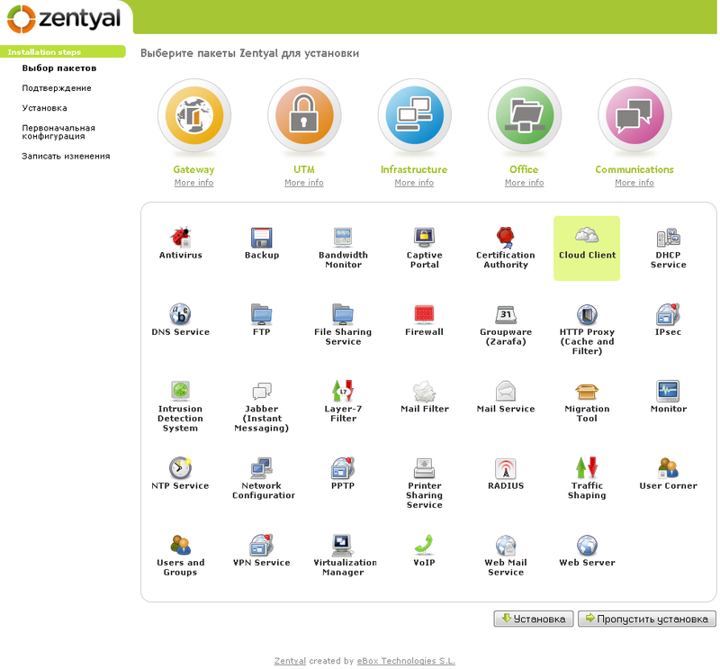
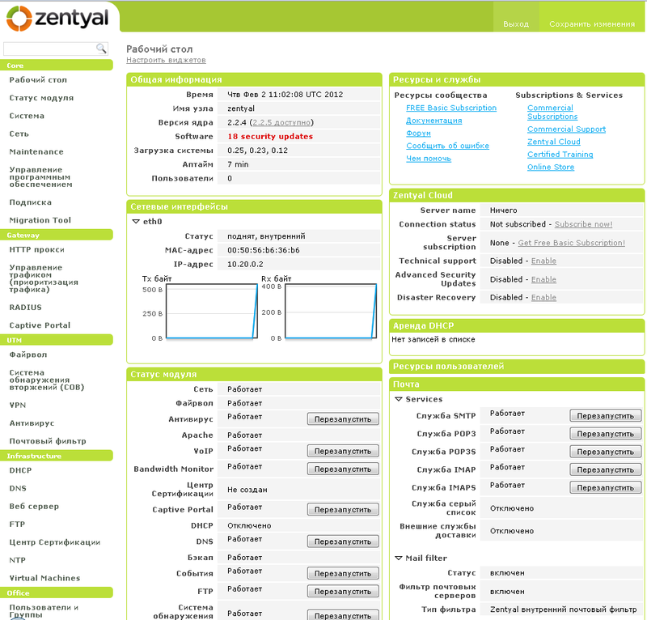
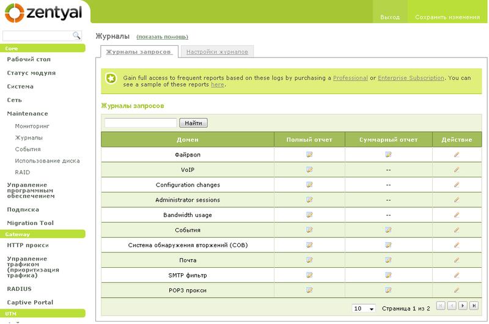
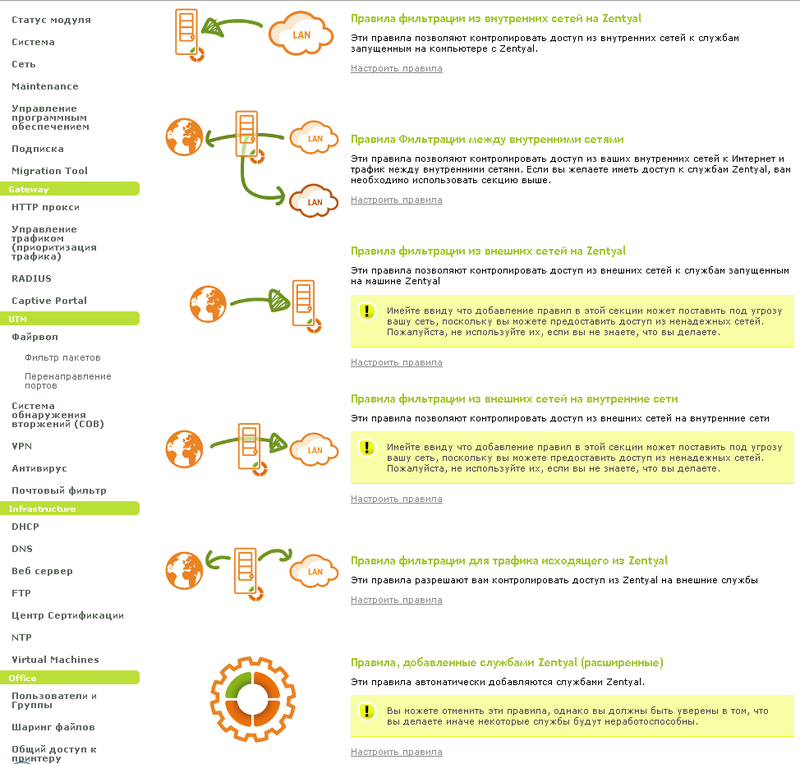

Наверняка многим начинающим системным администраторам трудно осваивать управление сервером в организации пользуясь только командной строкой. Свою работу в далеком 2010 году я начал с администрирования Win server 2003 и до определенного времени Linux подобные системы оставались для меня некой очень интересной загадкой с приятными плюшками на подобии средства распространения - GPL.<!--more-->

На протяжении долгого времени мне хотелось поближе познакомиться с линухами, однако постоянно находились отговорки на подобии - мне лень, пока не нужно и т.д. Познакомиться все же пришлось, причем не в самой располагающей обстановке - мне был дан доступ через ssh и примерный план работы, однако сейчас не об этом. Решив плотнее изучить Linux подобные ОС я перебирал множество сборок и наткнулся на дистрибутив, о котором и хочу написать Краткий обзор Zentyal.

* * *

Чем мне, впрочем как и огромному комьюнити понравился этот дистрибутив..

- Во первых GUI;
- Во вторых простота настройки.

### Итак начнем Краткий обзор Zentyal

Установив этот дистрибутив на свой рабочий ПК я остался очень доволен - он мне понравился!

По скольку Zentyal основан на Ubuntu, то описывать установку нет смысла, так как она очень похожа и не вызовет трудностей.

> После установки ОС сразу же запускается веб-браузер (Мозилла), где после ввода логина/пароля мы попадаем на страницу выбора пакетов, которые можно установить. Продолжительность установки пакетов зависит непосредственно от вашего выбора и скорости интернет соединения, я остановился только на самых необходимых мне пакетах - установка заняла около 10 минут.

Из коробки Zentyal можно настроить использовать в нескольких режимах:

1. Выделенный;
2. Slave.

В зависимости от выбора модулей Zentyal можно использовать в следующих ролях:

- Почтовый сервер;
- Веб-сервер;
- Прокси-сервер;
- Dhcp сервер.

Zentyal по умолчанию включает в себя антивирус, который будет мониторить весь трафик на присутствие зловредов. Одним из пунктов меню является меню включающее в себя логи, которые разделены по категориям (присутствует фильтрация).

**Firewall** - разобраться в его настройках становиться значительно легче, когда все сопровождается графическими схемами.

>  Подобное решение отлично подойдет для малого и среднего бизнеса. В интернете есть достаточное количество информации и мануалов по настройке. Несравненно положительным моментом является русскоязычный интерфейс в админ-панели.

**Лично я использую эту сборку в качестве прокси сервера, который раздает интернет в организации и параллельно собирает статистику посещений пользователями сайтов в сети интернет**.

В качестве анализатора логов squid можно использовать любой популярный вариант, лично мне понравился sarg. Если возникнут вопросы по настройке - смело пишите в комментариях.
