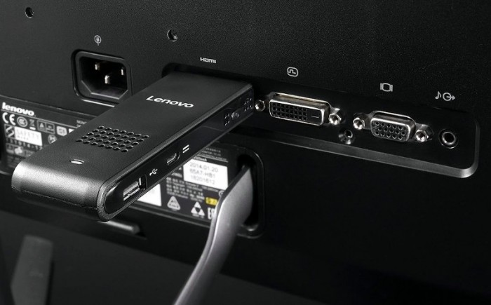

В конце июня китайская компания Lenovo официально представила свой новый продукт - микро-ПК Lenovo ideacentre Stick 300. <!--more-->Подключив его к HDMI входу, расположенному на мониторе или телевизоре, владелец ideacentre Stick 300 сможет превратить экран в полноценный компьютер.

Размеры микро-ПК совсем не большие - 100 × 38 × 15 мм, что приравнивает его к размеру мобильника.

Что под корпусом:

- Процессор: Intel Atom Z3735F Bay Trail;
- ОП - 2 ГБ;
- Постоянная память: до 32 ГБ;
- Модули связи: Wi-Fi 802.11 b/g/n и Bluetooth 4.0;
- Подключение внешних устройств: USB 2.0;
- Зарядка: Micro-USB.

 

Владельцы Lenovo ideacentre Stick 300 смогут осуществлять комфортный серфинг в сети интернет, просматривать и редактировать текстовые файлы, воспроизводить аудио и видео файлы. Работает этот девайс под управлением ОС Windows 8.1, в будущем разработчики рекомендуют обновляться до Windows 10.

Примерная стоимость на рос. рынке 11 тыс. рублей, что по мнению автора является завышенной ценой.
