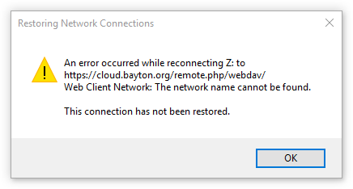
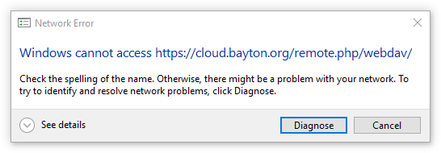
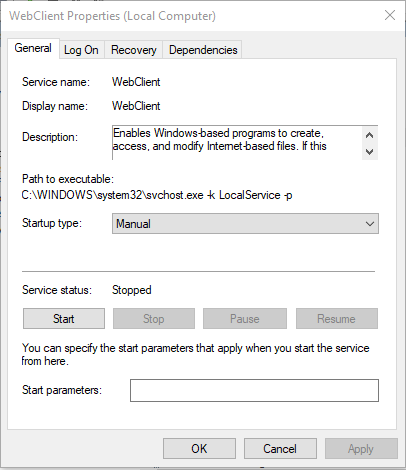

Ошибка возникает при попытке подключения сетевого хранилища через webdav стандартными средствами Windows.

<!--more-->

**Ошибка при попытке восстановления подключения:**

**Ошибка при попытке добавить новое подключение:**

**Причина:**

Статус службы "Веб-клиент" по умолчанию находится в положении "Запускать в ручную".

Изменяем тип запуска на " Запускать автоматически". Пробуем подключиться еще раз.

* * *

Процесс подключения сетевого хранилища через webdav пошагово описан на _[яндексе](https://yandex.ru/support/disk/webdav/webdav-win.html)._

* * *

Источник - _[bayton.org](https://bayton.org/docs/nextcloud/connecting-to-nextcloud-via-webdav-windows-cannot-access/)_
