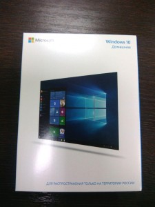
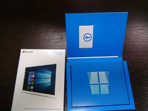
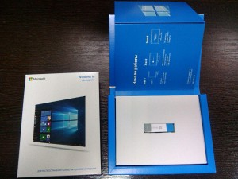

Ранее я [уже писал](http://admin.netlab-kursk.ru/windows-10-mozhno-budet-kupit-na-usb-nositele/), что с официальным анонсом Windows 10 мелкомягкие решили пересмотреть формат распространения коробочных лицензий на свой продукт. Под катом пара своих фотографий, которые не поленился сделать. <!--more-->

Внешний вид коробочной лицензии сильно изменился в размере, что и не удивительно - от дисков отказались.

Теперь никаких наклеек с лиц.кодом нет, есть вот такая карточка (ключ на обратной стороне, уж извините)

Установочный накопитель

Под лупой

