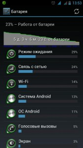

Эта статья не претендует на уникальность, однако советы представленные в ней действительно могут помочь заставить телефон жить на аккумуляторе немного дольше.<!--more-->

> Disclaimer: Все что вы делаете, вы делаете осознанно и на свой страх и риск. Автор не несет ответственности за работоспособность вашего аппарата!

Для выполнения всех действий требуется root

1. Нам понадобятся:
2. Аппарат
3. Программа [Disable Service](https://play.google.com/store/apps/details?id=cn.wq.disableservice&hl=ru) (продвинутые юзеры могут сразу устанавливать My Android Tools. Это более расширенная программа того же автора, но для начинающих в ней много лишнего. Продвинутые и богатые могут поддержать автора, купив Pro версию).
4. Программа [Wakelock Detector](https://play.google.com/store/apps/details?id=com.uzumapps.wakelockdetector&hl=ru)
5. Прямые руки

**Делаем бекап, на случай, если что-то пойдет не так, что бы потом не было мучительно больно!** Устанавливаем программу Wakelock Detector, следуем инструкции, смотрим, как резвятся программы и сервисы, не дают спать аппарату и жрут при этом батарею. Наполняемся праведным гневом, устанавливаем Disable Service и приступаем к делу.

В последних обновлениях Google Play, Корпорация Добра (тм) решила, что все пользователи андроида озаботились своим здоровьем, накупили браслетов и занимаются фитнесом в поте лица, меряя калории и пульсы на своих аппаратах.

Так же у всех резко появились наручные дисплеи для показа погоды и СМС. Заботясь об этом, Корпорация Добра (тм) напихала специальных сервисов для связи с этой носимой дребеденью, и повелела каждые 15 минут проверять, нету ли вблизи фитнесового браслета, не начать ли считать калории и пульсы, не показать ли пришедшую СМС'ку.

Поскольку у 99% пользователей таковых приблуд нет, аппарат, проснувшись, ничего не находит и скушав заряда батареи, снова засыпает, что бы через 15 минут повторить цикл. Приступаем.

* * *

#### **Запускаем Disable Service.**

Первую вкладку "Third party" мы пока не трогаем. Белые цифры - количество сервисов. Синие - количество запущенных сервисов, красные - количество деактивированнх сервисов. Сейчас их у нас будет. Переходим на вкладку "System", находим "Сервисы Google Play" - заходим туда. В левом верхнем углу нажимаем "full/short" - получаем полные названия сервисов и, пользуясь поиском (значек лупы) вводим заветные слова, сначала "fitness", потом "wearable" со всего что содержит эти слова снимаем галочки.

Затем ищем сервисы:

```
com.google.android.gms.auth.be.proximity.authorization.userpresence.UserPresenceService
com.google.android.gmx.config.ConfigFetchService
```

Прибиваем и их.

Затем ограничиваем обращение сервисов к поиску местоположения:

```
com.google.android.location.network.networklocationservice
com.google.android.location.fused.nlplocationreceiverservice 
com.google.android.location.geocode.geocodeservice 
com.google.android.location.internal.server.googlelocationservice 
com.google.android.location.reporting.service.reportingandroidservice 
com.google.android.location.reporting.locationreceiverservice 
com.google.android.location.reporting.service.reportingsyncservice 
com.google.android.location.reporting.service.locationhistoryinjectorservice 
com.google.android.location.reporting.service.initializerservice 
com.google.android.location.reporting.service.Settingschangedservice
```

**Первая часть работы сделана.**

> Дальнейшие копания в этой части лучше не делать просто так. Можете наоборот увеличить расход батареи из-за введения в цикл сервисов, у которых деактивирована часть, необходимая для корректного завершения их работы. В самом худшем случае - получите бутлуп. Хотя это и не страшно, у нас же есть бекап, правда ведь? Но лучше не доводить до беды и не лезть туда, куда не нужно. Помните! Не всегда название сервиса обозначает то, что вы думаете! Например, сервис GTalkService, к программе GTalk отношения никакого не имеет!

* * *

#### Теперь переходим на вкладку программ "Third Party"

Здесь - полная свобода действий, но опять же - с умом.

Лично я, прибил у Viber службу InAppBillingService, которому сильно не спалось, т.к. платными звонками в этой программе не пользуюсь. У программы 360 SmartKey отменил сервисы: CompatService и DownloadingService, они мне не нужны, кнопка работает и без них.

Для программ, которые должны периодически просыпаться (почта, погода, сообщения), лучше ничего не трогать.

Для более осмысленных действий хорошо бы прочитать ветки программ Disable Service и My Android Tools, но это для самых продвинутых юзеров. И так уже пришлось прочитать многабукафф :).

В конце - перезагружаем аппарат и при помощи Wakelock Detector наблюдаем его тихий храп. Если какая-то из программ еще мешает этому процессу - вы знаете что делать. Так же рекомендую установить программу Greenify, для усмирения особо буйных (типа - Facebook, Facebook Messenger и т.д.).

> В результате, получим реально долгоживущий аппарат без особых ограничений. Сколько и как - зависит от установленных у вас программ. У меня выигрыш составил около 30%. Поведение новых программ желательно проверять на первое время при помощи Wakelock Detector и, на основании этих данных, принимать решение о их дальнейшей судьбе.

В связи с популярностью этой темы мне бы хотелось "продемонстрировать" эффективность советов, которые приведены на сайте как в этой статье так и в других.

Честно говоря я давно забыл, что такое "заряжать телефон каждый вечер", т.к. необходимость в этом появляется один, максимум два раза в неделю.

[](http://admin.netlab-kursk.ru/wp-content/uploads/2015/05/save_battery.jpg)

Автор - [Kucher2000](http://4pda.ru/forum/index.php?showuser=270192)
