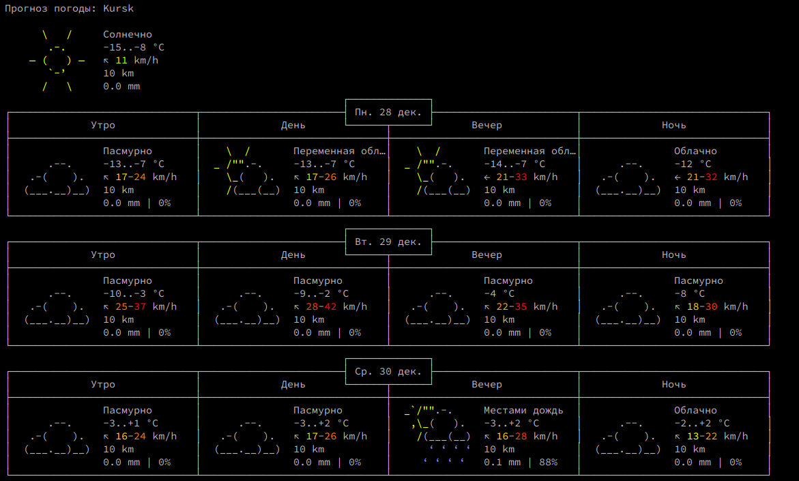

На досуге добавил в свой терминал очередной alias, решил поделиться.<!--more-->

Есть сайт [wttr.in](http://wttr.in), который мгновенно отдает погоду в зависимости от вашей локации.

В терминале запрос будет выглядеть так

```
curl wttr.in
```

Результат



Идем дальше - сделаем красиво.

```
nano ~/.bashrc
```

```
# Погода
alias погода='curl http://wttr.in'
```

Откроем терминал еще раз. Пишем "погода".

Результат сразу в консоли.
