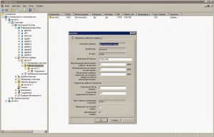

Подробный и полностью рабочий гайд по установке этой связки софта на ваши железки.<!--more-->

**Увеличиваем максимальный размер сегмента памяти до 4Гб (Обычно половина объема ОЗУ):**

```
#echo "kernel.shmmax=1073741824" >>/etc/sysctl.conf
#sysctl -p
```

**Генерируем необходимые локали и задаем переменную среды LANG, для работы скрипта инициализации БД.**

```
#locale-gen en_US ru_RU ru_RU.UTF-8
#export LANG="ru_RU.UTF-8"
```

**Устанавливаем необходимые зависимости:**

```
#apt-get install libssl0.9.8 libossp-uuid16 libxslt1.1 libicu52 libt1-5 t1utils imagemagick ttf-mscorefonts-installer unixodbc texlive-base libgfs-1.3-2
```

**Качаем с сайта 1C необходимые пакеты Postgre 9.2.4 и устанавливаем их именно в такой последовательности:**

```
#dpkg -i libpq5_9.2.4-1.1C_amd64.deb
#wget http://archive.ubuntu.com/ubuntu/pool/main/p/postgresql-common/postgresql-client-common_154_all.deb
#dpkg -i postgresql-client-common_154_all.deb
#dpkg -i postgresql-client-9.2_9.2.4-1.1C_amd64.deb
#wget http://archive.ubuntu.com/ubuntu/pool/main/p/postgresql-common/postgresql-common_154_all.deb
#dpkg -i postgresql-common_154_all.deb
```

**Пересобираем** **contrib:**

```
#dpkg -x postgresql-contrib-9.2_9.2.4-1.1C_amd64.deb tmpdir
#dpkg -e postgresql-contrib-9.2_9.2.4-1.1C_amd64.deb tmpdir/DEBIAN
#mcedit ./tmpdir/DEBIAN/control
ищем строку libicu46 (>= 1.4.6) и меняем ее на libicu52 (>= 1.4.6)
сохраняем изменения
#rm postgresql-contrib-9.2_9.2.4-1.1C_amd64.deb
#dpkg -b tmpdir postgresql-contrib-9.2_9.2.4-1.1C_amd64.deb
#dpkg -i postgresql-contrib-9.2_9.2.4-1.1C_amd64.deb
#dpkg -i postgresql-9.2_9.2.4-1.1C_amd64.deb
```

**Проверяем, запущен ли сервер:**

```
#service postgresql status
Выхлоп:
9.2/main (port 5433): online
```

**Создаем директорию для хранения баз банных 1С:**

```
#mkdir /mnt/1с/db/
#chown postgres:postgres -R /mnt/1c/db
```

**Инициализируем БД и создаем администратора БД:**

```
#su postgres
$/usr/lib/postgresql/9.2/bin/initdb -D /mnt/1c/db --locale=ru_RU.UTF-8
$psql -U postgres -c "alter user postgres with password 'наш_пароль';"
```

**Правим конфиг для корректной авторизации администратора БД (/mnt/1c/db/pg\_hba.conf).** _Меняем_:

```
# IPv4 local connections:
host all all 127.0.0.1/32 ident
# IPv6 local connections:
host all all ::1/128 ident
```

_На_:

```
# IPv4 local connections:
host all all 127.0.0.1/32 md5
# IPv6 local connections:
host all all ::1/128 md5
```

**Перезапускаем PostgreSQL:**

```
#service postgresql restart
```

**Проверяем:**

```
#netstat -atn|grep 5432
выхлоп:
tcp 0 0 0.0.0.0:5432 0.0.0.0:* LISTEN
значит все гуд
```

**На этом этапе установка PostgreSQL завершена.**

* * *

## Устанавливаем сервер 1С

**Создаем симлинк:**

```
#ln -s /usr/lib/x86_64-linux-gnu/libMagickWand.so.5 /usr/lib/x86_64-linux-gnu/libMagickWand.so
```

**Ставим все необходимые пакеты:**

```
#dpkg -i 1c-enterprise83-common_8.3.4-476_amd64.deb
1c-enterprise83-server_8.3.4-476_amd64.deb
1c-enterprise83-ws_8.3.4-476_amd64.deb
1c-enterprise83-common-nls_8.3.4-476_amd64.deb
1c-enterprise83-server-nls_8.3.4-476_amd64.deb
1c-enterprise83-ws-nls_8.3.4-476_amd64.deb
#wget http://old-releases.ubuntu.com/ubuntu/pool/universe/t/ttf2pt1/ttf2pt1_3.4.4-1.4_amd64.deb
#dpkg -i ttf2pt1_3.4.4-1.4_amd64.deb
```

**Разрешаем запись:**

```
#chown -R usr1cv8:grp1cv8 /opt/1C
```

**Перезапускаем сервер 1с:**

```
#service srv1cv83 restart
```

**Проверяем порты:**

```
#netstat -atn |grep 0.0.0.0:15

tcp 0 0 0.0.0.0:1560 0.0.0.0:* LISTEN
tcp 0 0 0.0.0.0:1540 0.0.0.0:* LISTEN
tcp 0 0 0.0.0.0:1541 0.0.0.0:* LISTEN
```

**Так же можно для профилактики проверить, все ли процессы сервера запущены:**

```
#ps aux|grep 1c

usr1cv8 28351 0.0 1.1 264284 22664 ? Ssl 10:01 0:00 /opt/1C/v8.3/x86_64/ragent -daemon
usr1cv8 28354 0.3 2.0 776216 41956 ? Sl 10:01 0:00 /opt/1C/v8.3/x86_64/rmngr -port 1541 -host test -range 1560:1591
usr1cv8 28378 0.1 1.6 323900 34076 ? Sl 10:01 0:00 /opt/1C/v8.3/x86_64/rphost -range 1560:1591 -reghost test -regport 1541 -pid f10fbd88-c9eb-11e3-0599-40618600e473
root 28439 0.0 0.0 13472 892 pts/2 S+ 10:03 0:00 grep --color=auto 1c
```

**Установка Sentinel HASP USB:**

```
#wget ftp://ftp.cis-app.com/pub/hasp/Sentinel_HASP/Runtime_(Drivers)/6.62/Sentinel_LDK_Ubuntu_DEB_Run-time_Installer.tar.gz
#dpkg --add-architecture i386
#apt-get update
#apt-get install libc6:i386
#dpkg -i aksusbd_2.2-1_i386.deb
#/etc/init.d/aksusbd restart
```

**Тушим сервер. Вставляем ключи USB. Запускаем сервер.**

```
#service aksusbd status

AKSUSB is running.
WINEHASP is running.
HASPLM is running.
```

**На этом этапе всё готово для создания БД из под оснастки Windows "Администрирование серверов предприятия"!!!!!!!!!!!!!!!!!!!**

* * *

### Возможные ошибки:

**_"Ошибка СУБД: ERROR: type "mvarchar" does not exist at character 31"_**

Означает что база данных была создана не из оснастки 1с. Необходимо удалить БД и создать ее из оснастки. \_\_\_\_\_\_\_\_\_\_\_\_\_\_\_\_\_\_\_\_\_\_\_\_\_\_\_\_\_\_\_\_\_\_\_\_\_\_\_\_\_\_\_\_\_\_\_\_\_\_\_\_\_\_\_\_\_\_\_\_\_\_\_\_\_\_\_\_\_\_

**1С Предприятие** **_Ошибка СУБД:_** **_ERROR: invalid byte sequence for encoding "UTF8": 0x01 (0x01 это для примера, адреса бывают разные)_**

Невосстановимая ошибка приводящая к вылету клиента Наблюдается на платформе 1C 8.3.4 и 8.3.5 Редко на УТ 10, и часто на УТ 11

Лекарство: Установить значение параметра standard\_conforming\_strings в конфиге postgresql.conf в значение 'off' Параметр лучше поправить как для БД, так и в глобальных настройках. \_\_\_\_\_\_\_\_\_\_\_\_\_\_\_\_\_\_\_\_\_\_\_\_\_\_\_\_\_\_\_\_\_\_\_\_\_\_\_\_\_\_\_\_\_\_\_\_\_\_\_\_\_\_\_\_\_\_\_\_\_\_\_\_\_\_\_\_\_\_

**_Ошибка при получении характеристик_** **_по причине:_** **_{(1, 31)}: Поле не найдено "Свойство.Presentation"_** **_SELECT <<?>>_**

Означает, что не хватает прав на справочники "ЗначенияСвойствОбъектов", "ЗначенияСвойствОбъектовИерархия" и план видов характеристик "ДополнительныеРеквизитыИСведения". Соответственно лечится установкой прав на эти объектов хотя бы на "чтение/просмотр" \_\_\_\_\_\_\_\_\_\_\_\_\_\_\_\_\_\_\_\_\_\_\_\_\_\_\_\_\_\_\_\_\_\_\_\_\_\_\_\_\_\_\_\_\_\_\_\_\_\_\_\_\_\_\_\_\_\_\_\_\_\_\_\_\_\_\_\_\_\_

### Улучшаем работу сервера 1С предприятие 8.3.5

Через оснастку администрирования серверов 1с для конкретной БД выставляем свойства:

_Количество ИБ на процесс = 1_ _Количество соединений на процесс = 10_

Это даёт нам автоматическую балансировку нагрузки по рабочим процессам. Сервер сам создаёт нужное количество рабочих процессов согласно указанным параметрам и также автоматически закрывает неиспользуемые рабочие процессы. Тем самым мы обеспечили не только балансировку, но и ротацию (перезагрузку) рабочих процессов с целью защиты от «пожирания памяти».

[](http://admin.netlab-kursk.ru/wp-content/uploads/2015/09/serv1c835.jpg)

за текст выражайте благодарности этому ростовскому [парню](https://www.blogger.com/profile/17029131705967099468).
