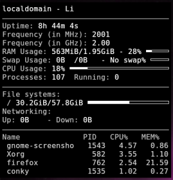

Подозреваю, что после установки ОС, почти каждый пользователь первым делом занимается персонализацией системы под себя. У абсолютного большинства людей все сводится к установке понравившихся обоев и замены цвета панелек. Я предлагаю пойти дальше, под катом краткий ман по установке Conky, а так же простой, но симпатичный конфиг для Conky.<!--more-->

## Установка Conky

Установка Conky стандартная, ничего нового тут не увидеть:

```
sudo apt-get install conky
```

Запустить программу после установки можно одноименной командой:

```
conky
```

В результате получаем дефолтный конфиг на экране

[](http://admin.netlab-kursk.ru/wp-content/uploads/2016/01/konky_default.png)

## Мой конфиг для Conky

Заинтересовавшись темой написания конфига, который бы меня полностью удовлетворил, я случайно наткнулся на товарища [Kano](https://elementary.today/forum/member/186-kano) , который задумался над этим еще раньше. В результате на базе его трудов я сделал свой конфиг, который выкладываю ниже.

[](http://admin.netlab-kursk.ru/wp-content/uploads/2016/01/admin46_conky_config.jpg)

[Скачать](http://admin.netlab-kursk.ru/upload/conky.tar.gz)

Установка конфига очень простая:

1. Скачать архив
2. Положить содержимое архива в домашнюю директорию пользователя (папки скрытые)

Запустить конфиг для Conky можно командой:

```
conky -c ~/.conky/conkyrc
```

Автозапуск можно реализовать добавив команду (через графический интерфейс - сеансы и запуск)

```
sh -c "sleep 5 && conky -c ~/.conky/conkyrc"
```

Данный ключ добавляет Conky а автозагрузку с задержкой в 5 секунд.
