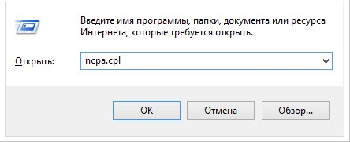
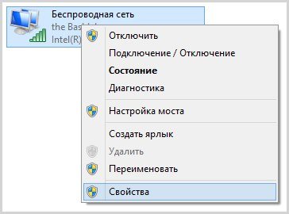
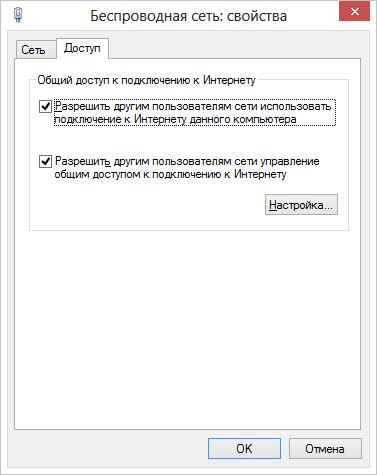
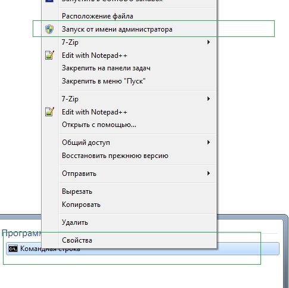
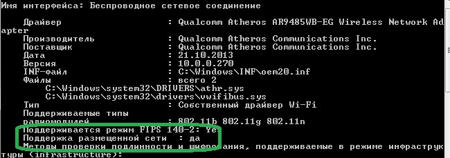
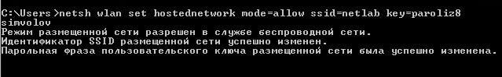
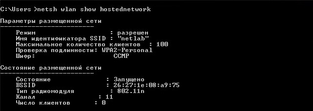

Есть вещи, которые можно с легкостью делать без установки дополнительных программ, для этого нужно просто знать алгоритм.

Давайте разберемся как реализовать раздачу wifi с ноутбука используя только одну командную строку. <!--more-->Разумеется, этот способ не единственный, однако автор использует именно его. Windows 7 и последующие ОС (8, 10) в этом плане предлагают довольно большую гибкость. _Клиенты, подключенные к точке, созданной таким образом, будут автоматически получать настройки по DHCP и сразу будут готовы к работе._

Максимально возможное количество подключенных устройств равно 100, а скорость канала связи (WiFi) созданного на моем ноутбуке равняется 74MB.

# Раздача WiFi с ноутбука через командную строку

1\. Откроем центр управления сетями:

> На клавиатуре Win + R (поочередно нажимаем на две эти кнопки)
> 
> Далее вводим:
> 
> ncpa.cpl

2\. Разрешим другим пользоваться вашим интернет каналом:

[](http://admin.netlab-kursk.ru/wp-content/uploads/2016/03/run-ncpa-cpl.jpg)

Затем выбираем действующее подключение

[](http://admin.netlab-kursk.ru/wp-content/uploads/2016/03/wireless-connection-windows.jpg)

Поставим пару галочек

[](http://admin.netlab-kursk.ru/wp-content/uploads/2015/05/wireless-network.jpg)

3\. Откроем командную строку (важно открыть ее от имени администратора системы):

Открываем "Пуск", в поле для поиска пишем : "командная строка"

[](http://admin.netlab-kursk.ru/wp-content/uploads/2016/03/adm_consol.jpg)

4\. Проверим поддерживает ли адаптер, установленный в ноутбуке, нужный нам режим работы:

> ```
> netsh wlan show drivers
> ```

[](http://admin.netlab-kursk.ru/wp-content/uploads/2016/03/netsh-wlan-show-driver.jpg)

Если вы видите указание о том, что он не поддерживается - пробуйте обновить драйвера.

5\. Зададим название сети и укажем пароль к ней (значения SSID и Key можно менять):

> ```
> netsh wlan set hostednetwork mode=allow ssid=netlab-kursk key=qwerty12
> ```

[](http://admin.netlab-kursk.ru/wp-content/uploads/2016/03/ssid_hotspot_wlan.jpg)

6\. Запустим раздачу wifi с ноутбука

> ```
> netsh wlan start hostednetwork
> ```

[](http://admin.netlab-kursk.ru/wp-content/uploads/2016/03/ssid_hotspot_wlan.jpg)

7\. Для просмотра информации о вашей точке доступа вводим следующую команду:

> ```
> netsh wlan show hostednetwork
> ```

[](http://admin.netlab-kursk.ru/wp-content/uploads/2016/03/show-wlan.jpg)

Как видно на скриншоте пользователю доступен просмотр названия его точки доступа, количество клиентов, статус ее работы, а так же канал беспроводной связи на котором она работает.

8\. Для того, чтобы остановить раздачу нужно выполнить следующую команду:

> ```
> netsh wlan stop hostednetwork
> ```

_Единственным недостатком этого способа является откат всех внесенных изменений после перезагрузки системы. Но поскольку раздача WiFi с ноутбука нужна мне только в особых случаях, подобный способ меня полностью устраивает._ _Однако не могу не согласиться с тем, что каждый раз вводить все эти команды вряд ли кому-нибудь захочется._ 

**Для запуска раздачи wifi через командную строку в один клик я сделал для себя два специальных файла:**

Раздача WiFi с ноутбука через командную строку - [СТАРТ](http://admin.netlab-kursk.ru/upload/Bat_wifi/wlan_start.bat)

Раздача WiFi с ноутбука через командную строку - [СТОП](http://admin.netlab-kursk.ru/upload/Bat_wifi/wlan_stop.bat)

При необходимости вы можете подправить их под свои нужды, для этого следует использовать "Блокнот". Если не хочется кликать на запуск каждый раз, то можно добавить скрипт в автозагрузку.
