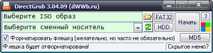
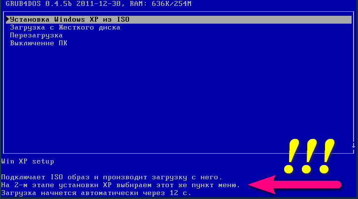

DirectGRUB - это мелкая утилита, которая позволит создавать загрузочные флешки с Win XP за пять минут.<!--more-->

## Создание загрузочной флешки с Windows XP

## 

На рисунке выше видно, что нужно выбрать образ, указать флэшку и нажать кнопку «Начать», и через пару минут загрузочный носитель будет готов.

* * *

### Установка

Выставляем в BIOS или Boot Menu приоритет загрузки с флэшки, загружаемся с неё, в загрузочном меню GRUB (см. рис. ниже) выбираем первую строчку: «Установка Windows XP из ISO» и начинаем установку. • Важно!!! По окончании текстового этапа установки (см.рис.) и перезагрузки, нужно снова загрузить компьютер с флэшки, выбрать тот же пункт меню GRUB (см.рис. ниже) и только после этого дать компьютеру возможность загрузиться с жесткого диска, НЕ нажимая никаких клавиш здесь.

[Скачать DirectGRUB](/upload/DirectGRUB.zip)
