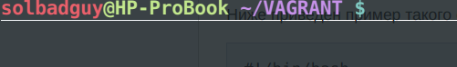
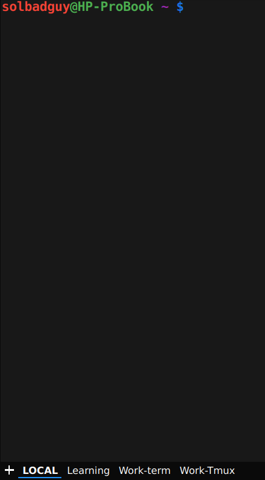

Yakuake — выпадающий эмулятор терминала, основанный на библиотеке приложения Konsole от KDE. В статье пойдет речь о том как его "готовить для себя", а так же об исправлении проблемы с которой мне пришлось столкнуться.<!--more-->

### Итак что умеет yakuake**:**

- Плавное появление из верхней части экрана;
- Поддержка вкладок;
- Настраиваемые размеры и скорость анимации;
- Поддержка стилей оформления;
- Поддержка интерфейса D-Bus.

* * *

### Проблемы и пути решения

Сразу после установки и кратковременного пользования были замечены странные полосы, которые занимали весь терминал в ширину.



 

 

 

Решение очень простое, добавляем в ваш .bashrc следующий код

```
# Убираем полосы в QT
export QT_SCREEN_SCALE_FACTORS=1
```

Для моей Fedora release 32 (Thirty Two) & plasmashell 5.18.5 это было решением проблемы.

* * *

Этот фикс актуален только для 32 федоры, а так же для запуска через обычный ярлык. Если для запуска использовать d-bus, то такой метод проблемы не решит, т.к. последний игнорирует файл настроек пользователя. Для себя проблему решил полностью переходом на Fedora 33.

* * *

### Yakuake user script - или как готовить его для себя.

Принцип очень простой. В домашнем каталоге создаем .sh скрипт, содержание которого можно увидеть ниже, делаем его исполняемым.  Добавляем скрипт в автозапуск. Вуаля.

```
#!/bin/bash

function instruct {
cmd="qdbus org.kde.yakuake $1"
eval $cmd &> /dev/null
sleep 0.5
}

# Создадим 4-ре вкладки
instruct "/yakuake/sessions org.kde.yakuake.addSession"
instruct "/yakuake/sessions org.kde.yakuake.addSession"
instruct "/yakuake/sessions org.kde.yakuake.addSession"
instruct "/yakuake/sessions org.kde.yakuake.addSession"

# Переименуем вкладки
instruct "/yakuake/tabs org.kde.yakuake.setTabTitle 0 LOCAL"
instruct "/yakuake/tabs org.kde.yakuake.setTabTitle 1 Learning"
instruct "/yakuake/tabs org.kde.yakuake.setTabTitle 2 Work-term"
instruct "/yakuake/tabs org.kde.yakuake.setTabTitle 3 Work-Tmux"

# Назначим команды
instruct "/Sessions/1 org.kde.konsole.Session.sendText 'echo Hello, Evgeniy!'"
instruct "/Sessions/2 org.kde.konsole.Session.sendText 'cd /home/solbadguy/GIT/learning'"
instruct "/Sessions/3 org.kde.konsole.Session.sendText 'ssh mywork'"
instruct "/Sessions/4 org.kde.konsole.Session.sendText 'tmux attach -t session1'"

# Выполняем команды
instruct "/Sessions/1 org.kde.konsole.Session.sendText \$'\n'"
instruct "/Sessions/2 org.kde.konsole.Session.sendText \$'\n'"
instruct "/Sessions/3 org.kde.konsole.Session.sendText \$'\n'"
instruct "/Sessions/4 org.kde.konsole.Session.sendText \$'\n'"

# Удаляем лишнюю вкладку
instruct "/yakuake/sessions org.kde.yakuake.removeSession 4"
```

* * *

**Выглядит так**



 

 

 

 

 

 

 

 

 

 

 

 

 

 

 

 

 

 

 

 

 

Обновляемый скрипт доступен на [Гитхабе](https://github.com/Solbadguy/yakuake-user-script).
